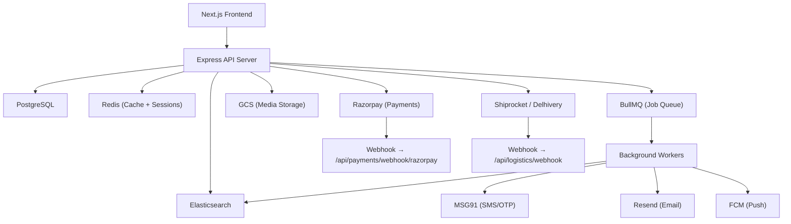

# 🚀 PHONEIFY — Master Project File
> This single file contains everything: project spec, architecture, and AI agent rules.

---

# PART 1 — PROJECT SPECIFICATION

## Overview
**Project:** Phoneify — Cashify-style used smartphone resale platform (India)
**Type:** Modular monolith | API-first | Production-grade web app
**Scope:** Full production web app (end-to-end, all layers)

---

## Stack

| Layer | Tech | Why |
|-------|------|-----|
| Frontend | Next.js | SSR, routing, DX |
| Backend | Node.js + Express | Familiar, modular |
| Database | PostgreSQL | Relational, reliable |
| Cache | Redis | Fast, queue-ready |
| Search | Elasticsearch | Full-text + filters |
| Media | GCS | Scalable object store |
| Queue | BullMQ | Job processing, retries |
| Cloud | GCP managed | Low-cost, managed |

---

## Modules

- **Quote** — Device condition + specs → dynamic price estimate
- **Sell** — List → inspection scheduling → doorstep pickup → seller payout
- **Buy** — Refurb listings → search/filter → cart → checkout → delivery tracking
- **Auth** — OTP (MSG91) + Google OAuth | JWT + refresh tokens | RBAC
- **Admin** — Orders | pricing rules | inventory | analytics dashboard | fraud flags
- **Payments** — Razorpay (buy side) + UPI/bank transfer (seller payout)
- **Notifications** — SMS (MSG91) | Email (Resend) | Push (FCM) | In-app
- **Search** — Full-text + filter by brand/price/condition/city (Elasticsearch)
- **Logistics** — Shiprocket/Delhivery webhook integration
- **Reviews** — Buyer rates device | seller rates experience
- **Wallet** — Credits | refunds | cashback

---

## Module Boundaries

| Module | Owns | Depends On | Shared Via |
|--------|------|------------|------------|
| Quote | Price logic, condition form | Devices, Pricing Rules | REST API |
| Sell | Listings, pickups, payouts | Quote, Logistics, Wallet | REST API |
| Buy | Orders, cart, checkout | Listings, Payments, Logistics | REST API |
| Auth | Users, sessions, tokens | — | JWT middleware |
| Admin | Pricing rules, fraud flags | All modules | Internal API |
| Payments | Razorpay orders, payouts | Buy, Wallet | Webhooks |
| Notifications | SMS/email/push/in-app | All modules | BullMQ jobs |
| Search | ES index, filters | Listings | REST API |
| Logistics | Shipments, tracking | Sell, Buy | Webhooks |
| Reviews | Ratings, feedback | Buy, Sell | REST API |
| Wallet | Credits, cashback, ledger | Payments, Sell | REST API |

---

## DB Entities

**users:** id, phone, email, role, google_id, created_at

**devices:** id, brand, model, storage, ram, color, created_at

**listings:** id, user_id, device_id, condition, price, status, city, created_at

**orders:** id, buyer_id, listing_id, payment_id, status, address, created_at

**quotes:** id, user_id, device_id, condition_score, estimated_price, created_at

**wallets:** id, user_id, balance, credits, cashback, updated_at

**reviews:** id, order_id, reviewer_id, rating, comment, type, created_at

**notifications:** id, user_id, type, channel, message, status, created_at

---

## REST API Routes

### Auth
| Method | Path | Purpose |
|--------|------|---------|
| POST | /api/auth/otp/send | Send OTP via MSG91 |
| POST | /api/auth/otp/verify | Verify OTP, issue JWT |
| POST | /api/auth/google | Google OAuth login |
| POST | /api/auth/refresh | Refresh access token |
| POST | /api/auth/logout | Invalidate session |

### Quote
| Method | Path | Purpose |
|--------|------|---------|
| GET | /api/devices | List supported devices |
| POST | /api/quote | Generate price estimate |
| GET | /api/quote/:id | Fetch saved quote |

### Sell
| Method | Path | Purpose |
|--------|------|---------|
| POST | /api/listings | Create new listing |
| GET | /api/listings/me | Seller's listings |
| PATCH | /api/listings/:id | Update listing |
| DELETE | /api/listings/:id | Remove listing |
| POST | /api/sell/schedule | Schedule pickup |
| GET | /api/sell/pickups | List scheduled pickups |

### Buy
| Method | Path | Purpose |
|--------|------|---------|
| GET | /api/listings | Browse listings |
| GET | /api/listings/:id | Listing detail |
| POST | /api/cart | Add to cart |
| GET | /api/cart | View cart |
| POST | /api/orders | Place order |
| GET | /api/orders/:id | Order detail |
| GET | /api/orders/me | Buyer order history |

### Payments
| Method | Path | Purpose |
|--------|------|---------|
| POST | /api/payments/razorpay/create | Create Razorpay order |
| POST | /api/payments/razorpay/verify | Verify payment signature |
| POST | /api/payments/webhook/razorpay | Razorpay webhook handler |
| POST | /api/payments/payout | Initiate seller payout |

### Wallet
| Method | Path | Purpose |
|--------|------|---------|
| GET | /api/wallet | Get wallet balance |
| GET | /api/wallet/transactions | Transaction history |
| POST | /api/wallet/redeem | Redeem credits |

### Search
| Method | Path | Purpose |
|--------|------|---------|
| GET | /api/search | Full-text + filter search |
| GET | /api/search/filters | Available filter options |

### Logistics
| Method | Path | Purpose |
|--------|------|---------|
| GET | /api/logistics/track/:orderId | Track shipment |
| POST | /api/logistics/webhook | Shiprocket/Delhivery webhook |

### Reviews
| Method | Path | Purpose |
|--------|------|---------|
| POST | /api/reviews | Submit review |
| GET | /api/reviews/:listingId | Reviews for listing |

### Admin
| Method | Path | Purpose |
|--------|------|---------|
| GET | /api/admin/orders | All orders |
| PATCH | /api/admin/orders/:id | Update order status |
| GET | /api/admin/listings | All listings |
| POST | /api/admin/pricing | Create pricing rule |
| GET | /api/admin/analytics | Dashboard metrics |
| GET | /api/admin/fraud | Fraud flagged items |

### Notifications
| Method | Path | Purpose |
|--------|------|---------|
| GET | /api/notifications | In-app notifications |
| PATCH | /api/notifications/:id/read | Mark as read |

---

## Infra Diagram

---

## Feature Rollout

| Feature | Phase 1 | Phase 2 | Phase 3 |
|---------|---------|---------|---------|
| Quote Engine | ✅ Core form + estimate | — | ML-based pricing |
| Sell Flow | ✅ Basic listing | Pickup scheduling | Auto-payout |
| Buy Flow | ✅ Browse + order | Cart + checkout | Recommendations |
| Auth | ✅ OTP login | Google OAuth | Full RBAC |
| Payments | ✅ Razorpay | Wallet payments | Cashback |
| Search | ✅ Basic filters | Elasticsearch | AI-powered search |
| Notifications | ✅ SMS | Email | Push + In-app |
| Logistics | ✅ Manual tracking | Shiprocket integration | Real-time tracking |
| Admin Dashboard | ✅ Order management | Pricing rules | Analytics + Fraud |
| Reviews | — | ✅ Post-delivery | Ratings dashboard |
| Wallet | — | ✅ Credits + refunds | Cashback + Ledger |

---
---

# PART 2 — AI AGENT RULES

## 🎯 Objective

You are an autonomous AI software engineer building **Phoneify**.
Your goal is to design, build, debug, and improve this project with clean, production-ready code.

Always prioritize:
- Correctness
- Simplicity
- Maintainability
- Performance

---

## 🧠 Core Behavior Rules

### 1. Think Before Acting
- Always identify which **Phoneify module** the task belongs to before writing any code
- Break problems into smaller steps
- Avoid unnecessary complexity
- This is a **modular monolith** — no microservices, no Kubernetes

### 2. Code Quality Standards
- Write clean, readable, and modular code
- Use meaningful variable and function names
- Follow consistent formatting
- Avoid duplication (DRY principle)
- Every module must be self-contained with clear boundaries

### 3. Project Awareness
Before making changes:
- Read existing files
- Identify which module you are touching
- Respect current architecture and module boundaries

**DO NOT:**
- Rewrite entire modules unnecessarily
- Introduce breaking changes without reason
- Add Kubernetes or microservices
- Over-engineer any solution

### 4. File Handling
- Create new files only when necessary
- Update existing files instead of duplicating logic
- Organize files by module

---

## 🏗️ Architecture Rules

### Frontend (Next.js)
- App Router — pages map to modules: `/quote`, `/sell`, `/buy`, `/admin`, `/wallet`
- Component-based, small and reusable
- Separate UI from business logic

### Backend (Express)
- One folder per module under `/modules/`
- Routes → Controllers → Services → DB
- Validate all inputs with Zod or Joi
- Route prefix per module: `/api/quote`, `/api/sell`, `/api/buy`, etc.

### Database (PostgreSQL)
- Use migrations — never edit DB directly
- Index on: brand, city, condition, price, status
- Never expose raw DB errors to the client

### Redis
- Cache: quote estimates, session tokens, filter options
- BullMQ job queues live here

### Elasticsearch
- Only for search queries — never for CRUD
- Sync from PostgreSQL via BullMQ workers, not inline

### BullMQ
- All async tasks go through queues: notifications, ES sync, payouts, webhook retries
- Never process these inside a request/response cycle

### GCS
- Device images uploaded here during listing
- Always serve via signed URLs — never public URLs

---

## 🔐 Security Rules

- All secrets in `.env` — never hardcoded
- JWT: short-lived access token + Redis-stored refresh token
- RBAC roles: `buyer`, `seller`, `admin` — enforce on every protected route
- Validate and sanitize all user inputs
- Prevent: XSS, SQL Injection, IDOR
- Razorpay: always verify `payment_id` + `signature` on webhook
- MSG91 and FCM keys must never be exposed client-side

---

## 💳 Payment Rules

- **Buy side:** Razorpay only — verify signature on every transaction
- **Sell side:** UPI or bank transfer after inspection is approved
- **Wallet:** Credits and cashback are internal ledger entries — never update balance without auth + validation

---

## 📦 Third-Party Integration Rules

| Service | Purpose | Critical Rule |
|---------|---------|---------------|
| MSG91 | OTP + SMS | Use approved templates |
| Google OAuth | Social login | Verify token server-side only |
| Razorpay | Buyer payments | Always verify webhook signature |
| Resend | Email | For order confirmations + alerts |
| FCM | Push notifications | Store device tokens per user |
| Shiprocket / Delhivery | Logistics + tracking | Handle webhooks idempotently |
| Elasticsearch | Search | Sync via BullMQ, never inline |
| GCS | Device image storage | Signed URLs only |

---

## ⚡ Performance Rules

- No N+1 queries — use joins or batch fetches
- All search via Elasticsearch — never PostgreSQL `LIKE`
- Redis for repeated reads (quotes, sessions, filters)
- BullMQ for all async tasks — never block the request thread
- Paginate all list endpoints (default: 20 items per page)

---

## 🧪 Testing & Debugging

- Write testable, modular code
- Add error handling on every route
- Use `pino` for logging — not `console.log`
- All webhook handlers must be idempotent (Razorpay, Shiprocket)

---

## 🧩 Task Execution Strategy

When given any task:
1. Identify which **Phoneify module** it belongs to
2. Check existing implementation in that module
3. Plan minimal changes needed
4. Implement step-by-step
5. Test the result
6. Refactor only if necessary

---

## 🚫 What to Avoid

- Microservices or Kubernetes
- Hardcoded values (prices, keys, phone numbers)
- Skipping input validation on any route
- Synchronous processing of notifications, search sync, or payouts
- Overengineering any module
- Ignoring existing module boundaries

---

## ✅ Output Expectations

Every output must be:
- Working
- Clean
- Minimal
- Easy to understand
- Scoped to the correct Phoneify module

---

## 📚 Context Memory

Always refer to these files before making decisions:
- `README.md` → project overview
- `AGENTS.md` (or this file) → rules
- `docs/` → detailed module documentation

---

## 🚀 Final Rule

Always act like a senior software engineer who writes code that others can easily understand, use, and scale — keeping Phoneify's modular monolith architecture intact at every step.
